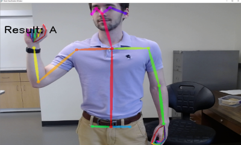
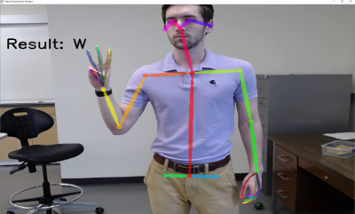
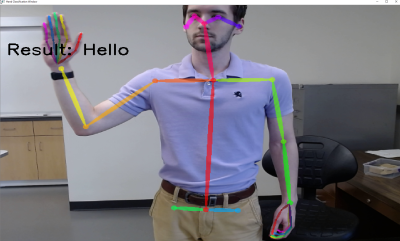
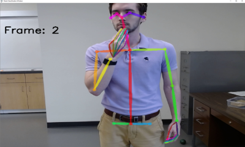
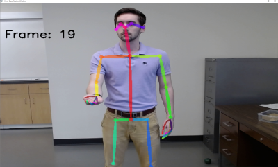

# Sign_Easy
A hand gesture recognition system that recognizes dynamic gestures. Used to translate several American Sign Language (ASL) gestures. 

A software project utilizing computer vision and machine learning techniques which can recognize 9 unique hand gestures. Program made by [Jacob Calfee](https://github.com/jacobcalf/), [Peter Hart](https://github.com/PeterHart23), and [Louis Wenner](https://github.com/novonn) with special recognition to [Michael Fasko Jr](https://github.com/Fasko).

## Inspiration
Advancements in computer vision have allowed for body data keypoint recognition, being able to detect specific parts of a human's body by providing X and Y coordinates of those specific body parts. This advancement in computer vision can be used for various projects across many different disciplines.

By using this technology, we were interested in seeing the accuracy of being able to detect unique hand gestures, which can eventually lead to creating a system of being able to transcribe signed languages (e.g. American Sign language) into writing.

## What It Does
Recognizes 4 unique Sign gestures: A, W, Thank You, and Hello.

## What Did We Use
Programming Language: Python
Software Libraries: OpenPose, TensorFlow Keras, OpenCV, scikit-learn, numpy.

## How We Built It
 Firstly, built a dataset by recording our own hand gestures, combining for:
 
     -> ~6,000 total labeled inputs
     
     -> ~1,500 labels per hand gesture
     
     -> ~120,000 frames recorded in total
     

Secondly, training a CNN by using TensorFlow Keras. 

Lastly, creating a demo application, which uses the trained model in order to predict a persons hand gestures. After testing with 10-Fold cross validation, the average model model loss and accuracy was:

     -> An accuracy of ~98.4%
     
     -> A loss of ~0.06 

# Known Issues

The program currently sometimes recieves false positives. This could be resolved by recollecting the data to improve it's consistency, or modifying the threshold for accepting a prediction. Generally speaking, our program works as expected. 

# Gestures

A: &nbsp;

W: &nbsp;

Hello: &nbsp;

Thank you: &nbsp;

